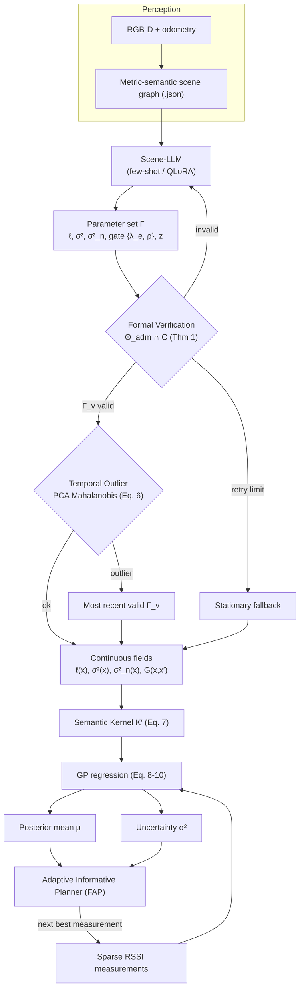
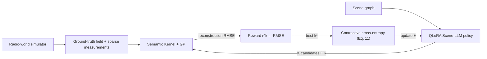

# Architecture

```mermaid
flowchart TD
    subgraph Perception
        RGBD["RGB-D + odometry"] --> SG["Metric-semantic scene graph (.json)"]
    end

    SG --> LLM["Scene-LLM<br/>(few-shot / QLoRA)"]
    LLM --> GAMMA["Parameter set Γ<br/>ℓ, σ², σ²_n, gate {λ_e, ρ}, z"]

    GAMMA --> VER{"Formal Verification<br/>Θ_adm ∩ C (Thm 1)"}
    VER -- "invalid" --> LLM
    VER -- "retry limit" --> FALL["Stationary fallback"]
    VER -- "Γ_v valid" --> OUT{"Temporal Outlier<br/>PCA Mahalanobis (Eq. 6)"}

    OUT -- "outlier" --> PREV["Most recent valid Γ_v"]
    OUT -- "ok" --> FIELDS["Continuous fields<br/>ℓ(x), σ²(x), σ²_n(x), G(x,x′)"]
    PREV --> FIELDS
    FALL --> FIELDS

    FIELDS --> KP["Semantic Kernel K′ (Eq. 7)"]
    MEAS["Sparse RSSI measurements"] --> GP["GP regression (Eq. 8-10)"]
    KP --> GP
    GP --> MU["Posterior mean μ"]
    GP --> SIG["Uncertainty σ²"]

    MU --> IPP["Adaptive Informative Planner (FAP)"]
    SIG --> IPP
    IPP -->|"next best measurement"| MEAS
```

## Fine-tuning loop (Fig. 3)

```mermaid
flowchart LR
    SIM["Radio-world simulator"] --> GT["Ground-truth field + sparse measurements"]
    SG2["Scene graph"] --> POL["QLoRA Scene-LLM policy"]
    POL -->|"K candidates Γ^k"| SK["Semantic Kernel + GP"]
    GT --> SK
    SK -->|"reconstruction RMSE"| REW["Reward r^k = -RMSE"]
    REW -->|"best k*"| CE["Contrastive cross-entropy (Eq. 11)"]
    CE -->|"update θ"| POL
```
